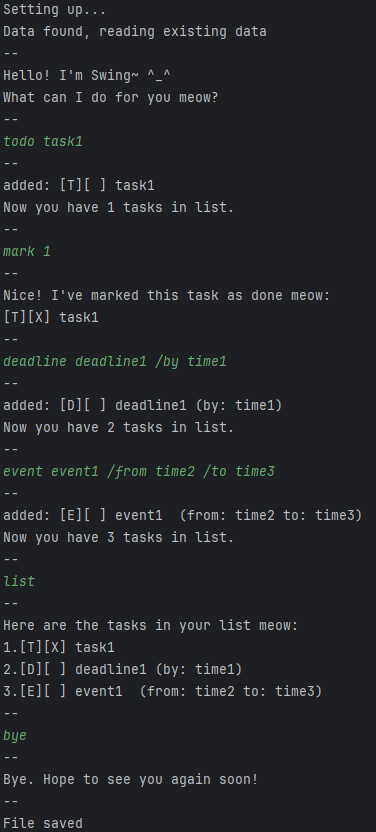

# Swing Chatbot User Guide
Meow~ I'm Swing, a chatbot designed to help you keep track of your tasks ^-^

Swing can keep track of tasks, events and deadlines in a list for you. 
You can mark or unmark them as required 
(but Swing is watching you! Do get your things done soon~).
Don't worry if you make a mistake, you can delete things in the list too.
Swing can also help you search your list if it gets too loooong.

Swing will automatically keep your data in data.txt after exiting and reload it upon next use.

Swing am a Command Line Interface (CLI)-only chatbot! 
Here's what Swing looks like in action:



# Features

## Add `deadline`
Add a deadline to the task list.

Example: `deadline homework /by 6pm`

Output:

```
--
added: [D][ ] homework (by: 6pm)
Now you have 1 tasks in list.
--
```

## Add `event`
Add an event to the task list.

Example: `event lecture /from 4pm /to 6pm`

Output:

```
--
added: [E][ ] lecture  (from: 4pm to: 6pm)
Now you have 1 tasks in list.
--
```

## Add `todo`
Add a todo task to the task list.

Example: `todo reading`

Output:

```
--
added: [T][ ] reading
Now you have 1 tasks in list.
--
```
## Mark a task
Mark the specified task number as done.

Example: `mark 1`

Output:
```
--
Nice! I've marked this task as done meow:
[T][X] task1
--
```

## Unmark a task
Mark the specified task number as NOT done.

Example: `unmark 1`

Output:
```
--
Aw man, I guess you're not done yet. Do it soon meow:
[T][ ] task1
--
```
## Delete a task
Remove the specified task number from the list.

Example: `delete 1`

```
--
Okay, I've removed this task meow:
[T][ ] task1
Now you have 0 tasks in list.
--
```
## Keyword search
Return a list of all tasks containing the searched keyword.

Example: `find work`

Output:
```
--
Here are the matching tasks in your list meow:
1.[D][ ] homework (by: 6pm)
2.[T][ ] workout
--
```

## Show `list`
Show the full list of tasks.

Usage: `list`

Example Output:
```
--
Here are the tasks in your list meow:
1.[T][X] task1
2.[D][ ] deadline1 (by: time1)
3.[E][ ] event1  (from: time2 to: time3)
4.[D][ ] homework (by: 6pm)
5.[E][ ] lecture  (from: 4pm to: 6pm)
6.[T][ ] reading
--
```

## End Session
Type `bye` to terminate the current chatbot session and save your data.

Output:
```
--
Bye. Hope to see you again soon!
--
File saved
```